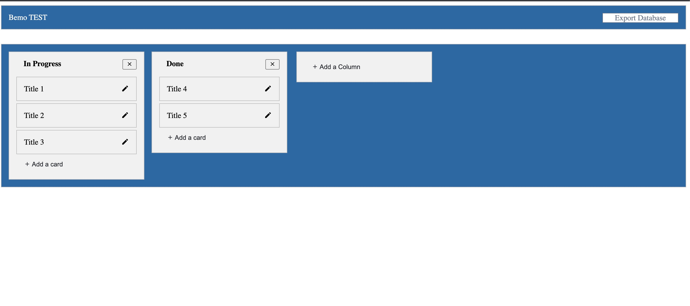

    <h1 align="center">BEMO Developer Functional Test</h1>

    

    
##  Introduction

This is a mock programming practice for BEMO to get to know some of my skill sets.

  
###  Technologies used

This application is built using:

- [x] Laravel 9
- [x] VueJS 2
- [x] SCSS with BEM standard  

## License

  

The Laravel framework is open-sourced software licensed under the [MIT license](https://opensource.org/licenses/MIT).
